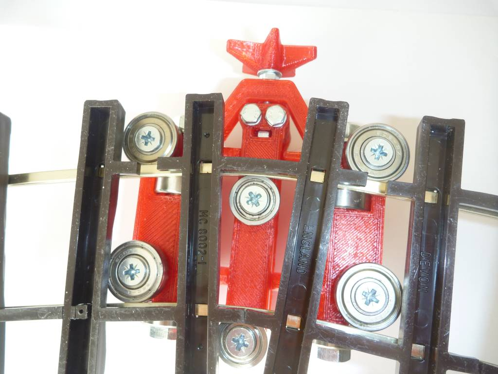

This 3D printed garden train "G" track bender is designed to bend flexible "G" tracks without disassembling them as is needed by simple rail benders 
It was tested on Code 250 Peco track in Silvernickel, which is very difficult to bend without tooling as it is very springy and always return back to its original shape.   
It is closely derived from my original "oakbender" build in oak. 
Designed just for fun, to see how easier it could be built compared to oak building.  
 
 

Bill of Material
- bearings 608 (8x) and F688 (2x)
- Wood screw, countersunk head, diam 5x40 (6x)
- Medium washer M5 (8x) - below bearing
- Simple nut M4 (4x)
- Bolt M8x80 (2x) - bearing assembly
- Bolt M4x40 (3x), hex head - pusher and push bar assembly
- small washers M4 (4x)
- medium washer M4 (2x)
- Small washer M8 (4 x)

To install OpenSCAD applications and models, see http://rouzeau.net/Print3D/OpenSCADApplications

Pour installer les applications et modèles OpenSCAD, voir  http://rouzeau.net/OpenSCAD/Applications

