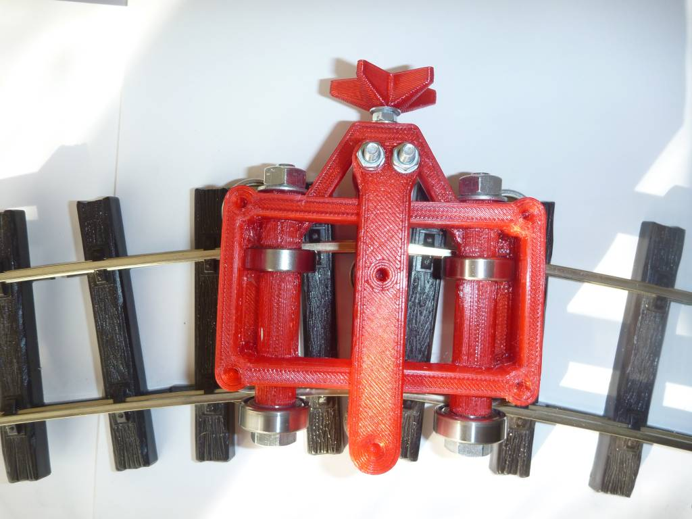

This plastic garden train "G" track bender is closely derived from the "oakbender" build in oak.  
This is one rare design which was usable at first print, however slightly improved and reinforced since (to simplify screw supply). 
Designed just for fun, to see how easier it could be built compared to oak building.  

BOM:
- bearings 608 (8x) and F688 (2x)
- Wood screw, countersunk head, diam 5x40 (6x)
- Medium washer M5 (8x) - below bearing
- Simple nut M4 (2x)
- Bolt M8x80 (2x) - bearing assembly
- Bolt M4x40 (3x), hex head - pusher and push bar assembly
- small washers M4 (4x)
- medium washer M4 (2x)
- Small washer M8 (4 x)

